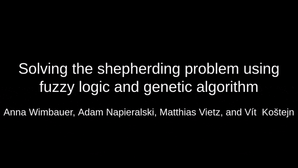

# Solving the shepherding problem with Fuzzy logic & genetic algorithms
This repository contains the source code to tackle the shepherding problem first defined by Strömbom et al. [[1]](#1).
It includes a shepherd environment based on the implementation of [shepherd_gym](https://github.com/buntyke/shepherd_gym).
It includes three behavior models for the shepherd. The first is the model presented in Strömbom et al. [[1]](#1).
The second model adapts the Strömbom algorithm and changes the decision between collecting and driving to a fuzzy decision system.
The third model uses genetic algorithms to lead the shepherd.

## Requirements
- numpy>=1.15.0
- matplotlib>=2.2.2
- simpful >=2.5.1

## Usage
```
python shepherd_simulation.py [-h] [-v] [-nr] [-vi] [N] [n] [max_steps]

Run the Strömbom simulation with fuzzy logic

positional arguments:
  N                 Total number of sheep
  n                 Number of neighbors sheep take into account
  max_steps         Max number of steps to run the simulation

optional arguments:
  -h, --help        show this help message and exit
  -v, --verbose     Print verbose informations
  -nr, --no-render  Toggle if the simulation shall be run with visualization
  -vi, --video      Toggle to enable exporting of every frame into a folder "/video", to create a video with ffmpeg afterwards.

```
For genetic algorithms, see inside [this folder](./genetic_algorithms).

## Example Run


## Authors
`shepherding-collective-behavior` was written by `Anna Wimbauer, Adam Napieralski, Matthias Vietz, and Vít Koštejn`.

## References
<a id="1">[1]</a>
Strömbom, D., Mann, R. P., Wilson, A. M., Hailes, S., Morton, A. J., Sumpter, D. J., & King, A. J. (2014). Solving the shepherding problem: heuristics for herding autonomous, interacting agents. Journal of the royal society interface, 11(100), 20140719.
